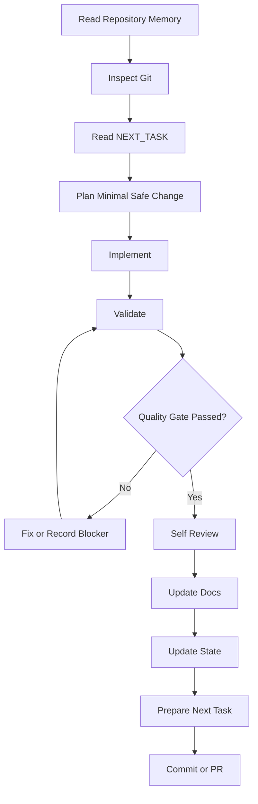

# Operating Loop

```mermaid
flowchart TD
    A[Read Repository Memory] --> B[Inspect Git]
    B --> C[Read NEXT_TASK]
    C --> D[Plan Minimal Safe Change]
    D --> E[Implement]
    E --> F[Validate]
    F --> G{Quality Gate Passed?}
    G -- No --> H[Fix or Record Blocker]
    H --> F
    G -- Yes --> I[Self Review]
    I --> J[Update Docs]
    J --> K[Update State]
    K --> L[Prepare Next Task]
    L --> M[Commit or PR]
```
