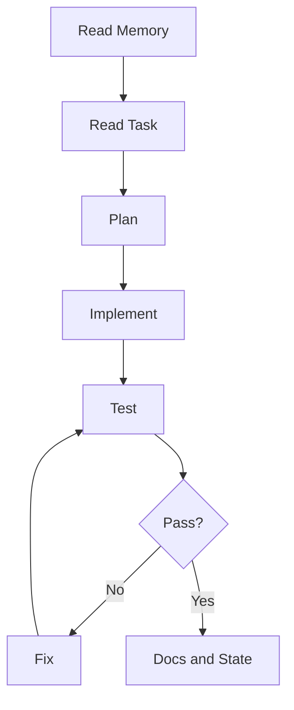

# Development Loop

```mermaid
flowchart TD
    A[Read Memory] --> B[Read Task]
    B --> C[Plan]
    C --> D[Implement]
    D --> E[Test]
    E --> F{Pass?}
    F -- No --> G[Fix]
    G --> E
    F -- Yes --> H[Docs and State]
```
