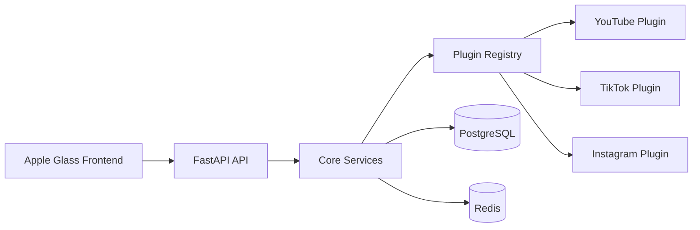

# Foundation Architecture

AutoShortAI is platform-neutral. External platforms are plugins.

```mermaid
flowchart LR
    UI[Apple Glass Frontend] --> API[FastAPI API]
    API --> CORE[Core Services]
    CORE --> REG[Plugin Registry]
    REG --> YT[YouTube Plugin]
    REG --> TT[TikTok Plugin]
    REG --> IG[Instagram Plugin]
    CORE --> DB[(PostgreSQL)]
    CORE --> R[(Redis)]
```
