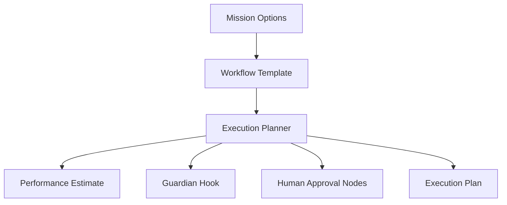

# Mission Engine Architecture

```mermaid
flowchart TD
A[Mission Options] --> B[Workflow Template]
B --> C[Execution Planner]
C --> D[Performance Estimate]
C --> E[Guardian Hook]
C --> F[Human Approval Nodes]
C --> G[Execution Plan]
```

Complexity may be internal if UX remains simple.
